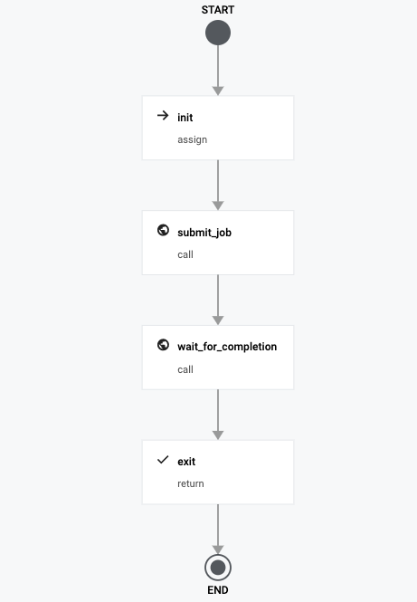

# Serverless Batch Job using GKE AutoPilot

Trigger a Batch Job on GKE AutoPilot, making it Serverless.

**TODO**: This example needs to be modified to consider jobs that are longer than 30min. Refer to the main README of this repository.




#### Deploy

```
gcloud workflows deploy serverless-gke-batch-job \
--source=workflow.yaml \ 
[--location=MY_LOCATION]
[--service-account=MY_SERVICE_ACCOUNT@MY_PROJECT.IAM.GSERVICEACCOUNT.COM]
```

Assumptions:
- You already have a GKE cluster running. If not, start a new one using AutoPilot option (fully managed by GCP and serverless)
- You already have GS bucket. If not, create a new one.

#### Sample Input

```
{
    "cloudbuild_component":"workflow-component-cloudbuild",
    "cluster_name":"mlcontainers",
    "compute_zone":"asia-southeast1",
    "gcs_log_bucket":"YOURBUCKET",
    "gcs_log_prefix":"_workflows/containers/test/exec/",
    "job_definition_location":"gs://YOURBUCKET/pipelines/sample.yaml",
    "job_name":"mypi",
    "project_id":"xxxxx",
    "workflow_exec":"executionid",
    "workflow_id":"customname"
}
```

- cloudbuild_component: You must have deployed the custom connector for CloudBuild. Use its name.
- cluster_name: GKE Cluster
- compute_zone: Zone of your GKE cluster
- gcs_log_bucket: Any GCS bucket
- gcs_log_prefix: Used as transient area to monitor job status
- job_definition_location: Kubernetes Job definition. You can use sample-job.yaml
- job_name: Job name
- project_id: Your project ID. Can be replaced by Workflow environment variable.
- workflow_exec: Unique execution ID
- workflow_id: Prefix of the job that will be created in GKE cluster. Could use Workflow environment variable.


#### Sample Output

GKE job description

```
{
  "apiVersion": "batch/v1",
  "kind": "Job",
  "metadata": {
    "creationTimestamp": "2021-02-27T15:57:27Z",
    "name": "test-exec2-mypi",
    "namespace": "default",
    "resourceVersion": "786098",
    "selfLink": "/apis/batch/v1/namespaces/default/jobs/test-exec2-mypi",
    "uid": "647eeff6-b235-40f6-bb1e-d450161ae392"
  },
  "spec": {
    "backoffLimit": 4,
    "completions": 1,
    "parallelism": 1,
    "selector": {
      "matchLabels": {
        "controller-uid": "647eeff6-b235-40f6-bb1e-d450161ae392"
      }
    },
    "template": {
      "metadata": {
        "annotations": {
          "seccomp.security.alpha.kubernetes.io/pod": "runtime/default"
        },
        "creationTimestamp": null,
        "labels": {
          "controller-uid": "647eeff6-b235-40f6-bb1e-d450161ae392",
          "job-name": "test-exec2-mypi"
        }
      },
      "spec": {
        "containers": [
          {
            "command": [
              "perl",
              "-Mbignum=bpi",
              "-wle",
              "print bpi(2000)"
            ],
            "image": "perl",
            "imagePullPolicy": "Always",
            "name": "pi",
            "resources": {
              "limits": {
                "cpu": "500m",
                "ephemeral-storage": "1Gi",
                "memory": "2Gi"
              },
              "requests": {
                "cpu": "500m",
                "ephemeral-storage": "1Gi",
                "memory": "2Gi"
              }
            },
            "securityContext": {
              "capabilities": {
                "drop": [
                  "NET_RAW"
                ]
              }
            },
            "terminationMessagePath": "/dev/termination-log",
            "terminationMessagePolicy": "File"
          }
        ],
        "dnsPolicy": "ClusterFirst",
        "restartPolicy": "Never",
        "schedulerName": "default-scheduler",
        "securityContext": {},
        "terminationGracePeriodSeconds": 30
      }
    }
  },
  "status": {
    "completionTime": "2021-02-27T15:59:48Z",
    "conditions": [
      {
        "lastProbeTime": "2021-02-27T15:59:48Z",
        "lastTransitionTime": "2021-02-27T15:59:48Z",
        "status": "True",
        "type": "Complete"
      }
    ],
    "startTime": "2021-02-27T15:57:27Z",
    "succeeded": 1
  }
}
```